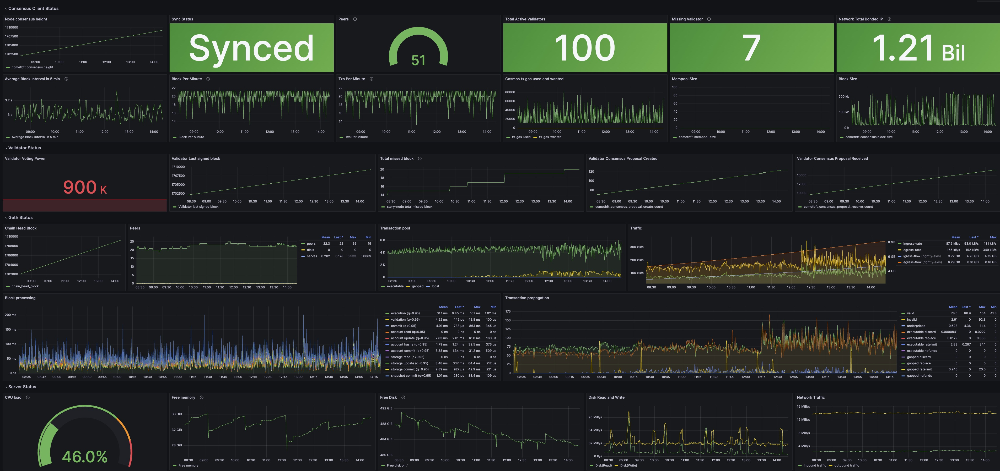

# Story Grafana Dashboard

A Grafana dashboard for Story blockchain created by silent validator, including story consensus client status, validator status, geth status, and server status.

## Dashboard Preview



## How to Use

To use this dashboard, you need to enable Prometheus metrics on the Story consensus client and Story Geth, and open the corresponding ports.

### 1. Story Consensus Client Setup

Enable Prometheus metrics in the story consensus client configuration file `config.toml`:

```bash
sed -i "s/prometheus = false/prometheus = true/g" $HOME/.story/story/config/config.toml
```

The default port is 26660.

### 2. Story Geth Node Setup

Enable Prometheus metrics by adding metrics flags to the geth execution. For example:

```bash
geth --iliad --syncmode full --http --ws --metrics --metrics.addr 0.0.0.0 --metrics.port 6060
```

Restart the node to make the changes take effect.

### 3. Install and Run Node Exporter

Install and run Node Exporter to expose your server status metrics:

1. Download and install Node Exporter from the [official GitHub repository](https://github.com/prometheus/node_exporter).

2. Run Node Exporter as a background service.

3. Ensure it's accessible on the default port 9100.

For detailed installation instructions, refer to the Node Exporter documentation.

### 4. Prometheus Settings

Add the following to your `prometheus.yml`:

```yaml
  - job_name: "story-nodeexporter"
    static_configs:
      - targets: ["<YOUR IP>:9100"]
        labels:
          label: "story-node"
  - job_name: "story-metrics"
    static_configs:
      - targets: ["<YOUR IP>:26660"]
        labels:
          label: "story-node"
  - job_name: "story-geth"
    metrics_path: /debug/metrics/prometheus
    static_configs:
      - targets: ["<YOUR IP>:6060"]
        labels:
          label: "story-node"
```

### 5. Grafana Setup

1. Import the JSON file in your Grafana.
2. Use your Prometheus as the data source.

## Contributing

Issues and pull requests are welcome to improve this dashboard.


